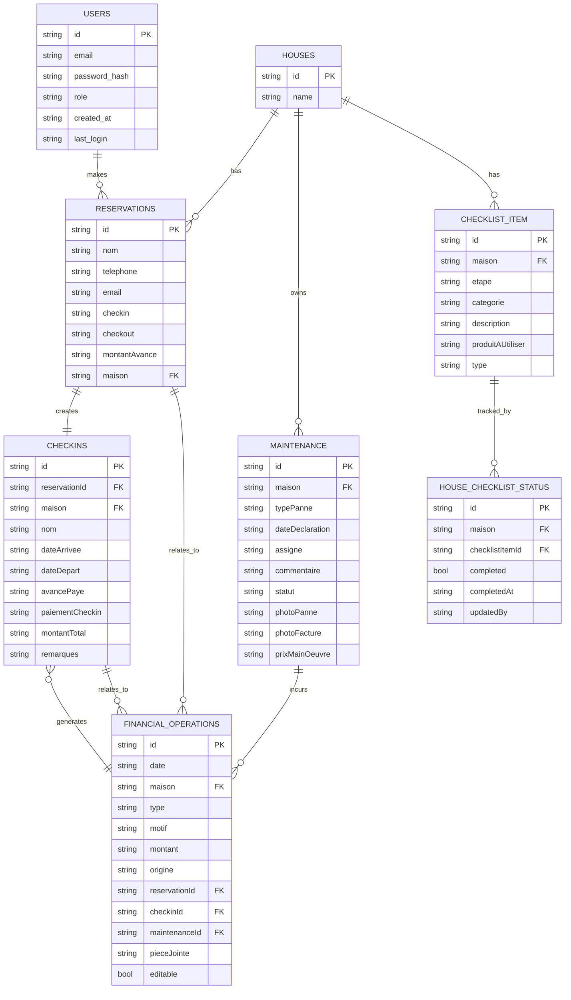

# ResidenceManager ERD and SQL Schema

This document captures the core business entities, their relationships, and the SQL schema (SQLite) to create the necessary tables with primary keys (PK) and foreign keys (FK). It is derived from the backend documentation and the model definitions described in the repository.

## 1) Business Logic Summary

- Reservation → Check-in → Payment: A guest creates a reservation with an advance payment, which triggers a corresponding financial transaction. Upon arrival, a check-in is created and a remaining payment is processed, producing another financial transaction. The reservation/check-in pairing drives revenue tracking.
- Maintenance → Finance: Maintenance issues are tracked and, when costs are incurred and resolved, corresponding expense transactions are generated.
- Dashboard Metrics: Real-time/calculated metrics rely on check-ins, check-outs, maintenance status, occupancy, and payments.
- Data Integrity: All relationships use foreign keys to enforce referential integrity between reservations, check-ins, maintenance, finances, and houses.

## 2) Entities, Attributes, and Keys

- Users
  - id (PK)
  - email
  - password_hash
  - role (user | admin)
  - created_at
  - last_login

- Houses
  - id (PK)
  - name

- Reservations
  - id (PK)
  - nom
  - telephone
  - email
  - checkin
  - checkout
  - montantAvance
  - maison (FK to Houses.id)

- CheckIns
  - id (PK)
  - reservationId (FK to Reservations.id)
  - maison (FK to Houses.id)
  - nom
  - dateArrivee
  - dateDepart
  - avancePaye
  - paiementCheckin
  - montantTotal
  - remarques

- FinancialOperations
  - id (PK)
  - date
  - maison (FK to Houses.id)
  - type (entree | sortie)
  - motif
  - montant
  - origine (reservation | checkin | maintenance | manuel)
  - reservationId (FK to Reservations.id, nullable)
  - checkinId (FK to CheckIns.id, nullable)
  - maintenanceId (FK to Maintenance.id, nullable)
  - pieceJointe
  - editable (boolean)

- Maintenance
  - id (PK)
  - maison (FK to Houses.id)
  - typePanne (electricite | plomberie | electromenager | peinture | autre)
  - dateDeclaration
  - assigne
  - commentaire
  - statut (resolue | non-resolue)
  - photoPanne
  - photoFacture
  - prixMainOeuvre

- ChecklistItem
  - id (PK)
  - maison (FK to Houses.id)
  - etape
  - categorie
  - description
  - produitAUtiliser
  - type (nettoyage | vérification | entretien)

- HouseChecklistStatus
  - id (PK)
  - maison (FK to Houses.id)
  - checklistItemId (FK to ChecklistItem.id)
  - completed (boolean)
  - completedAt
  - updatedBy

## 3) ER Diagram (Mermaid)



Notes:
- The diagram uses standard Mermaid erDiagram syntax with PKs/FKs reflected in the naming (PK, FK).
- Relationships reflect the business rules: reservations create financials, check-ins tie to reservations and financials, maintenance ties to financials, and houses own related records.

## 4) SQL Schema (SQLite)

CREATE TABLE users (
  id TEXT PRIMARY KEY,
  email TEXT NOT NULL UNIQUE,
  password_hash TEXT NOT NULL,
  role TEXT NOT NULL CHECK (role IN ('user','admin')),
  created_at TEXT,
  last_login TEXT
);

CREATE TABLE houses (
  id TEXT PRIMARY KEY,
  name TEXT
);

CREATE TABLE reservations (
  id TEXT PRIMARY KEY,
  nom TEXT,
  telephone TEXT,
  email TEXT,
  checkin TEXT,
  checkout TEXT,
  montantAvance REAL,
  maison TEXT,
  FOREIGN KEY (maison) REFERENCES houses(id)
);

CREATE TABLE checkins (
  id TEXT PRIMARY KEY,
  reservationId TEXT,
  maison TEXT,
  nom TEXT,
  dateArrivee TEXT,
  dateDepart TEXT,
  avancePaye REAL,
  paiementCheckin REAL,
  montantTotal REAL,
  remarques TEXT,
  FOREIGN KEY (reservationId) REFERENCES reservations(id),
  FOREIGN KEY (maison) REFERENCES houses(id)
);

CREATE TABLE financial_operations (
  id TEXT PRIMARY KEY,
  date TEXT,
  maison TEXT,
  type TEXT CHECK (type IN ('entree','sortie')),
  motif TEXT,
  montant REAL,
  origine TEXT CHECK (origine IN ('reservation','checkin','maintenance','manuel')),
  reservationId TEXT,
  checkinId TEXT,
  maintenanceId TEXT,
  pieceJointe TEXT,
  editable BOOLEAN,
  FOREIGN KEY (maison) REFERENCES houses(id),
  FOREIGN KEY (reservationId) REFERENCES reservations(id),
  FOREIGN KEY (checkinId) REFERENCES checkins(id),
  FOREIGN KEY (maintenanceId) REFERENCES maintenance(id)
);

CREATE TABLE maintenance (
  id TEXT PRIMARY KEY,
  maison TEXT,
  typePanne TEXT,
  dateDeclaration TEXT,
  assigne TEXT,
  commentaire TEXT,
  statut TEXT CHECK (statut IN ('resolue','non-resolue')),
  photoPanne TEXT,
  photoFacture TEXT,
  prixMainOeuvre REAL,
  FOREIGN KEY (maison) REFERENCES houses(id)
);

CREATE TABLE checklist_item (
  id TEXT PRIMARY KEY,
  maison TEXT,
  etape INTEGER,
  categorie TEXT,
  description TEXT,
  produitAUtiliser TEXT,
  type TEXT CHECK (type IN ('nettoyage','vérification','entretien')),
  FOREIGN KEY (maison) REFERENCES houses(id)
);

CREATE TABLE house_checklist_status (
  id TEXT PRIMARY KEY,
  maison TEXT,
  checklistItemId TEXT,
  completed BOOLEAN,
  completedAt TEXT,
  updatedBy TEXT,
  FOREIGN KEY (maison) REFERENCES houses(id),
  FOREIGN KEY (checklistItemId) REFERENCES checklist_item(id)
);

## 5) PK, FK Summary

- Primary Keys (PK)
  - users.id
  - houses.id
  - reservations.id
  - checkins.id
  - financial_operations.id
  - maintenance.id
  - checklist_item.id
  - house_checklist_status.id

- Foreign Keys (FK)
  - reservations.maison -> houses.id
  - checkins.reservationId -> reservations.id
  - checkins.maison -> houses.id
  - financial_operations.maison -> houses.id
  - financial_operations.reservationId -> reservations.id
  - financial_operations.checkinId -> checkins.id
  - financial_operations.maintenanceId -> maintenance.id (nullable)
  - maintenance.maison -> houses.id
  - checklist_item.maison -> houses.id
  - house_checklist_status.maison -> houses.id
  - house_checklist_status.checklistItemId -> checklist_item.id

## 6) Development Notes

- This ERD aligns with the backend design described in ResidenceManager/backend/README_BACKEND.md and the models present under ResidenceManager/backend/app/models/.
- If you plan to migrate to a production database (e.g., PostgreSQL), adjust data types accordingly (e.g., TIMESTAMP, BOOLEAN, UUID) and consider naming conventions for cross-database compatibility.
- For API integration in the frontend, ensure the API base URL matches the backend server’s root (e.g., /api/v1) and that CORS is configured to allow frontend origins.

## 7) PostgreSQL Migration Guide (New)

To enable a PostgreSQL-based backend with migration-ready SQL, use the following schema. This uses UUIDs with gen_random_uuid() (provided by the pgcrypto extension). Ensure the extension is enabled in your database.

```sql
-- Enable UUID generation
CREATE EXTENSION IF NOT EXISTS "pgcrypto";

CREATE TABLE users (
  id UUID PRIMARY KEY DEFAULT gen_random_uuid(),
  email TEXT NOT NULL UNIQUE,
  password_hash TEXT NOT NULL,
  role TEXT NOT NULL CHECK (role IN ('user','admin')),
  created_at TIMESTAMP WITHOUT TIME ZONE,
  last_login TIMESTAMP WITHOUT TIME ZONE
);

CREATE TABLE houses (
  id UUID PRIMARY KEY DEFAULT gen_random_uuid(),
  name TEXT NOT NULL
);

CREATE TABLE reservations (
  id UUID PRIMARY KEY DEFAULT gen_random_uuid(),
  nom TEXT,
  telephone TEXT,
  email TEXT,
  checkin DATE,
  checkout DATE,
  montantAvance NUMERIC,
  maison UUID,
  CONSTRAINT fk_res_maison FOREIGN KEY (maison) REFERENCES houses(id)
);

CREATE TABLE checkins (
  id UUID PRIMARY KEY DEFAULT gen_random_uuid(),
  reservationId UUID,
  maison UUID,
  nom TEXT,
  dateArrivee DATE,
  dateDepart DATE,
  avancePaye NUMERIC,
  paiementCheckin NUMERIC,
  montantTotal NUMERIC,
  remarques TEXT,
  CONSTRAINT fk_che_res FOREIGN KEY (reservationId) REFERENCES reservations(id),
  CONSTRAINT fk_che_maison FOREIGN KEY (maison) REFERENCES houses(id)
);

CREATE TABLE maintenance (
  id UUID PRIMARY KEY DEFAULT gen_random_uuid(),
  maison UUID,
  typePanne TEXT,
  dateDeclaration DATE,
  assigne TEXT,
  commentaire TEXT,
  statut TEXT CHECK (statut IN ('resolue','non-resolue')),
  photoPanne TEXT,
  photoFacture TEXT,
  prixMainOeuvre NUMERIC,
  CONSTRAINT fk_maint_maison FOREIGN KEY (maison) REFERENCES houses(id)
);

CREATE TABLE financial_operations (
  id UUID PRIMARY KEY DEFAULT gen_random_uuid(),
  date TIMESTAMP WITHOUT TIME ZONE,
  maison UUID,
  type TEXT CHECK (type IN ('entree','sortie')),
  motif TEXT,
  montant NUMERIC,
  origine TEXT CHECK (origine IN ('reservation','checkin','maintenance','manuel')),
  reservationId UUID,
  checkinId UUID,
  maintenanceId UUID,
  pieceJointe TEXT,
  editable BOOLEAN,
  CONSTRAINT fk_fin_maison FOREIGN KEY (maison) REFERENCES houses(id),
  CONSTRAINT fk_fin_reservation FOREIGN KEY (reservationId) REFERENCES reservations(id),
  CONSTRAINT fk_fin_checkin FOREIGN KEY (checkinId) REFERENCES checkins(id),
  CONSTRAINT fk_fin_maintenance FOREIGN KEY (maintenanceId) REFERENCES maintenance(id)
);

CREATE TABLE checklist_item (
  id UUID PRIMARY KEY DEFAULT gen_random_uuid(),
  maison UUID,
  etape INTEGER,
  categorie TEXT,
  description TEXT,
  produitAUtiliser TEXT,
  type TEXT CHECK (type IN ('nettoyage','vérification','entretien')),
  CONSTRAINT fk_ci_maison FOREIGN KEY (maison) REFERENCES houses(id)
);

CREATE TABLE house_checklist_status (
  id UUID PRIMARY KEY DEFAULT gen_random_uuid(),
  maison UUID,
  checklistItemId UUID,
  completed BOOLEAN,
  completedAt TIMESTAMP WITHOUT TIME ZONE,
  updatedBy TEXT,
  CONSTRAINT fk_hcs_maison FOREIGN KEY (maison) REFERENCES houses(id),
  CONSTRAINT fk_hcs_item FOREIGN KEY (checklistItemId) REFERENCES checklist_item(id)
);


